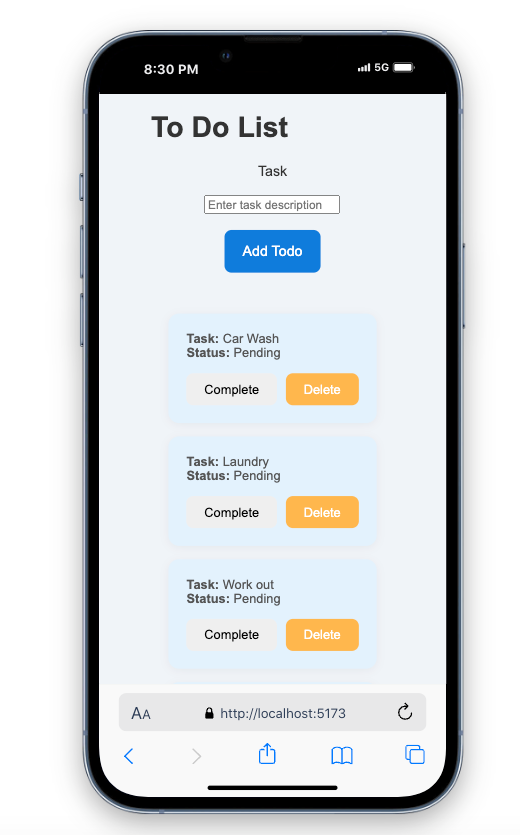

To Do List App 

The To Do List Application is a app that wllows a user to create, track and manage their to-do tasks seamlessly. The app utilizes white-space for a simple, clean and visually pleasing UI experience, allowing a user to organize their day-to-day life tasks. 

**Features**

- Add, delete, and complete tasks.
- Responsive design suitable for both desktop and mobile devices.
- Tasks can be marked as completed, with a visual indicator.
- Simple and intuitive user interface.

**Screenshots**

**Technologies Used**

- Frontend: HTML, CSS, JS, React
- Backend: Node.js, Express
- Database: PostgreSQL, Postico
- Version Control: Git

**Set up**

Prerequisites
- Node.js
- npm 
- PostgreSQL 

**How to use the App**

- Add a Task: Enter a task description and click the "Add Todo" button.
- Mark as Completed: Click the "Complete" button next to a task to mark it as completed.
- Delete a Task: Click the "Delete" button to remove a task from the list.

